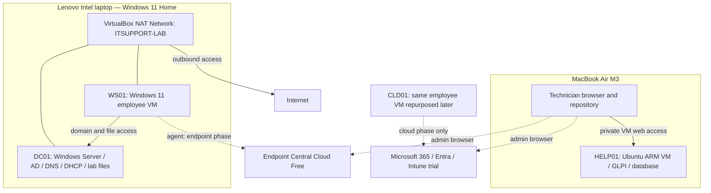

# Melbourne IT Support Lab

A practical portfolio project for junior and Level 1 IT support roles in Melbourne: build a small business IT environment, operate its service desk, and investigate realistic support requests.

**Status: M0 host preflight complete; M1 has not started.** The Intel Lenovo and Apple Silicon Mac passed the documented resource, virtualisation, storage, subnet, and tooling checks. Lenovo results are owner-run and attributed as such; Mac results were observed locally. No project VM, support case, ticket, or skill is claimed as completed.

## Start here

1. Read [project scope](docs/01-project-scope.md) and [architecture](docs/02-architecture.md).
2. Follow the [implementation plan](docs/04-implementation-plan.md), starting at **M0**.
3. Update [STATUS.md](STATUS.md) at the end of each work session.

## What is being built

**Part A — Workplace environment:** Windows Server, Active Directory, DNS/DHCP, a Windows client, file permissions, endpoint management, basic macOS support, and a later Microsoft 365/Intune phase.

**Part B — Support operations:** GLPI tickets and assets, a knowledge base, monitoring checks, 32 defined support cases, three small PowerShell utilities, recovery exercises, and evidence suitable for interviews.

The fictional organisation is **Yarra Office Services**, a 20-person professional services business. Only six synthetic staff identities and one employee Windows VM are needed. The project does not represent a real employer or production deployment.

## Architecture at a glance

WS01 and CLD01 are **sequential identities of one VM**, not two simultaneous machines. The cloud phase begins after the local cases are complete. The two laptops' virtual networks are separate; there is no assumed direct route from Windows VMs to GLPI. The technician uses GLPI on the Mac and records Windows findings manually.

## Completion levels

| Level | Meaning |
|---|---|
| Local core complete | M0–M5 gates pass; 24 local cases have evidence; required local skills and documentation are demonstrated |
| Full v1 complete | Local core plus M6–M7; eight additional cloud cases and the Microsoft 365/Intune requirements are demonstrated |
| Extensions | Google Workspace administration, Jamf, physical imaging and deeper networking; tracked separately and never silently required for v1 |

If trial access prevents M6, publish an honestly labelled local portfolio with the cloud gap visible. Do not call the full project complete.

## Documents

| Document | Purpose |
|---|---|
| [Scope](docs/01-project-scope.md) | Outcome, priorities, exclusions and definition of done |
| [Architecture](docs/02-architecture.md) | Machines, network, identity, permissions and cloud transition |
| [Constraints and costs](docs/03-constraints-and-costs.md) | RAM/storage budgets, trial timing, fallbacks and risks |
| [Implementation plan](docs/04-implementation-plan.md) | Ordered work packages, dependencies, time estimates and gates |
| [Service operations](docs/05-service-operations.md) | Ticket workflow, priorities, communication and credential handling |
| [Scenario catalogue](docs/06-scenario-catalogue.md) | Fault setup, diagnosis, recovery and evidence for every case |
| [Validation and coverage](docs/07-validation-and-coverage.md) | Acceptance tests, scoring and practical skill assessment |
| [Repository and portfolio](docs/08-repository-and-portfolio.md) | GitHub workflow, publication controls and interview evidence |
| [Automation specifications](docs/09-automation-specifications.md) | Bounded contracts for three future scripts |
| [Decisions](docs/10-decisions.md) | Settled choices and reasons |
| [Sources](docs/11-sources.md) | Official product references and dates |
| [Requirements matrix](docs/12-requirements-matrix.md) | All 26 core skills mapped to the supplied ads and support cases |

## Repository contents

- `config/lab-plan.json`: intended configuration, not a deployment script.
- `tracking/requirements.json`: fixed core skill list and current evidence state.
- `tracking/scenarios.json`: case IDs, dependencies, outcomes and execution states.
- `templates/`: tickets, knowledge articles, runbooks, build records and session handovers.
- `evidence/`: only deliberately reviewed, sanitised portfolio evidence.
- `scripts/`: future lab scripts; initially contains specifications only.
- `tools/validate_repo.py`: checks plan consistency, local Markdown links and evidence references using Python's standard library.
- `.local/`: ignored location for private notes and raw captures; create it only when needed.

Run repository checks with `python3 tools/validate_repo.py` on macOS, or `py -3 tools/validate_repo.py` on Windows with Python installed. This verifies repository consistency, **not** the live lab.

## Budget and honesty

Target additional spend: **A$0**, using existing hardware, free tools and eligible evaluations. This is not a promise of a permanently free Microsoft environment. Trials, feature availability, account approval and hardware checks remain implementation gates. No paid service or public cloud VM is required by the design.

Use the project on a CV as an **Independent IT Support Lab**. Describe tools actually used and tasks actually demonstrated. Tool substitutes establish transferable workflows, not experience with a different vendor's product.
